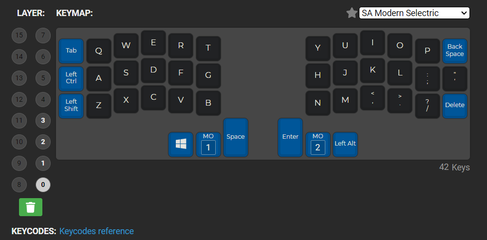
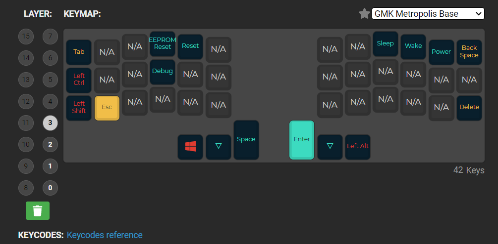

Layer 0

Layer 1

Layer 2

Layer 3

Commands:

Default
qmk compile -kb crkbd/rev1 -km default -e CONVERT_TO=elite_pi
or
qmk flash -c -kb crkbd/rev1 -km default -e CONVERT_TO=elite_pi

Configuration for single keyboard:

qmk config user.keyboard=crkbd/rev1

qmk config user.keymap=Olejekglejek

qmk setup Olejekglejek/qmk_firmware
or
qmk setup -H /d/Code/keyb/qmk_firmware Olejekglejek/qmk_firmware

qmk compile -e CONVERT_TO=elite_pi -flto=auto

Convert olejekglejek.json to keymap.c file using QMK-MSYS terminal

qmk json2c olejekglejek.json

-   Copy output to keymap.c file
